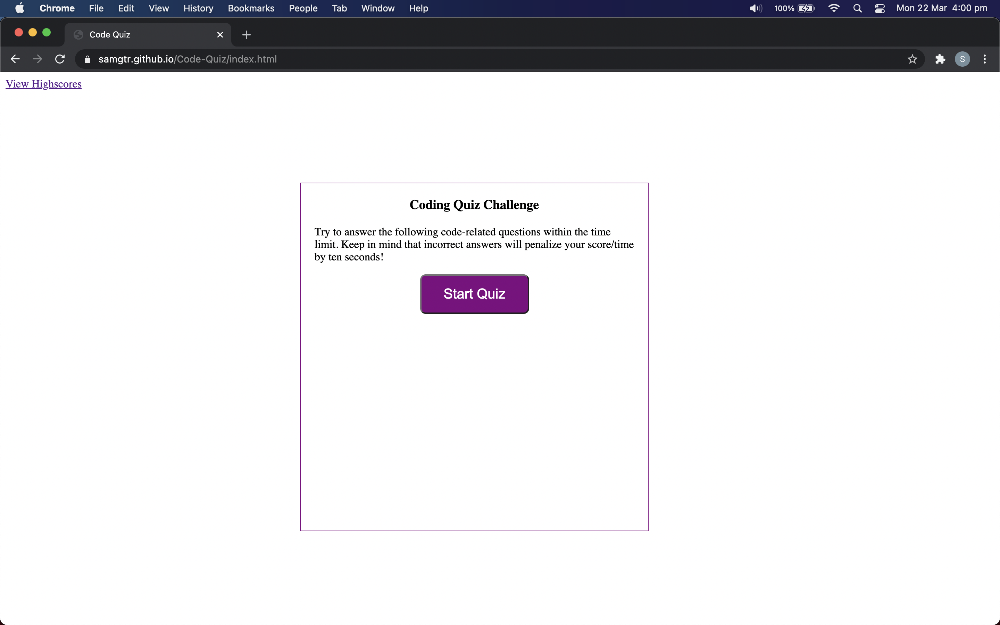
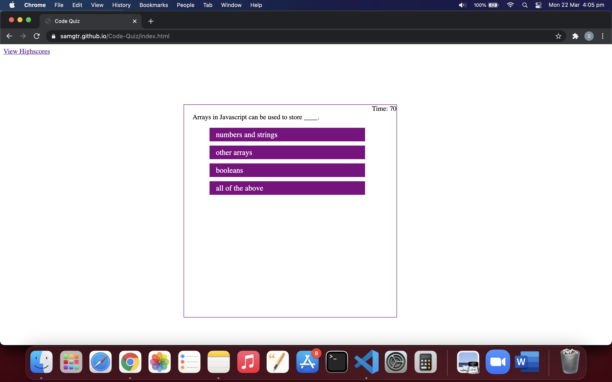
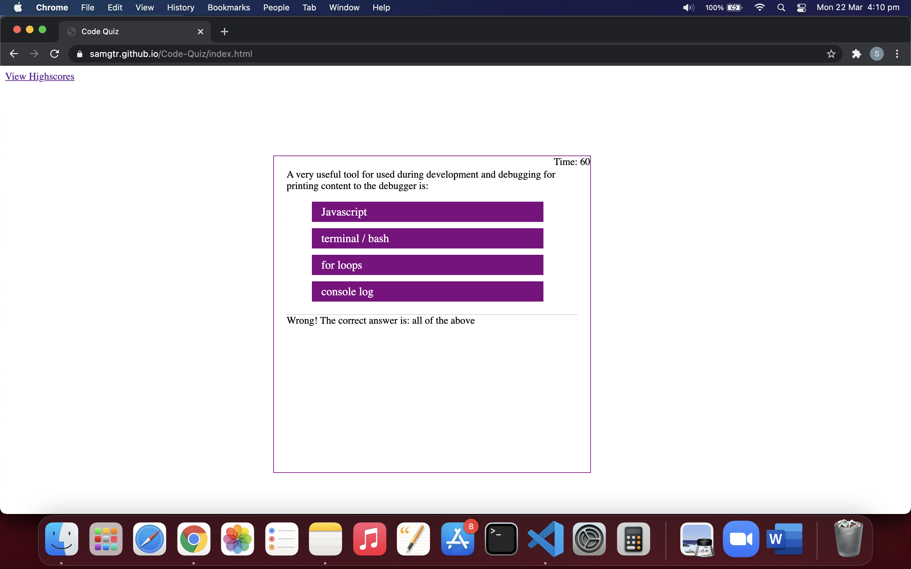
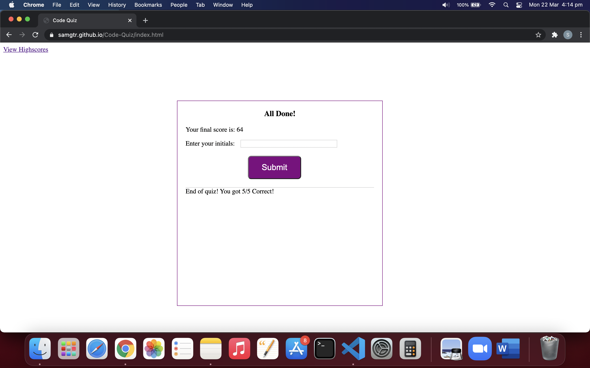
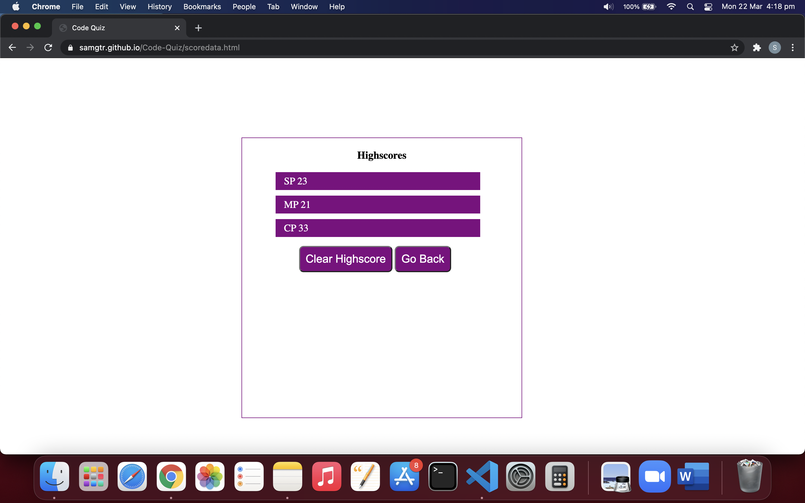

# Code-Quiz

This web application is developed as Week-4 Homework requirement.  
This application is a coding quiz application designed using Javascript. The user is presented with different multiple choice questions. User's response it stored and a score is displayed after the quiz.
User's intitials and score is stored in lcoalstorage and available when requested.

## Installation

- Git clone the application from : https://github.com/SamGTR/Code-Quiz.git
- Navigate to the index.html.
- Open the index.html file with any web browser.

## Description

This applicationw as developed from scratch using HTML, CSS and Javascript files. The features of the application are as below:

- On running the application, user is presented with browser layout with information about Coding Quiz and Start button. Also, there is link to view Highscore.

- When the user clicks the "Start Quiz" button, user is presented with a multipple choice question. Immediately timer also starts counting down from 75 seconds.

- When user clicks the correct answer, the application displays message of the answer being correct.

- If the user enters wrong answer then the application shows the message that the answer is wrong and also shows the correct answer next to it.

- Once user answers all the five questions, he will be presented with final statistics of the quiz such as total score. Also, user will be asked to enter the initial of his/her name.

- The user need to enter his/her initials and click the "Submit" button.

- Once the user clicks the submit button, the application shows the list of high scores with initials stored in local storage. User can either click "Clear Highscore" button to clear all scores or press "Go Back" button to go to landing page of the application.

## Technology

The web application is developed using HTML, CSS and Javascript files. 
- This application uses two html files to switch between landing page and highscores page.
- The CSS file includes features like media query for 786px and 640px. 
- This applcation uses two javascript files. The scoredata.js is developed for the functionality of Go back button and clear highscores. The questions.js is developed for displaying the questions and answers and storing the data. Both the Javascript files consist of eventlistener for noticing clicks, if else statements and for loops.

## Links

Following is the link to the Code-Quiz application:  
https://samgtr.github.io/Code-Quiz/

Following is the link to the Github repository for Password Generator application:  
https://github.com/SamGTR/Code-Quiz

## License

MIT